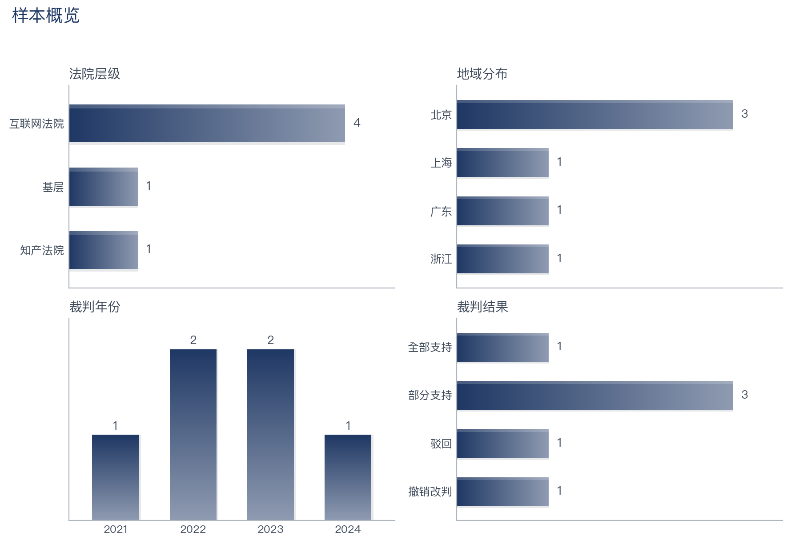
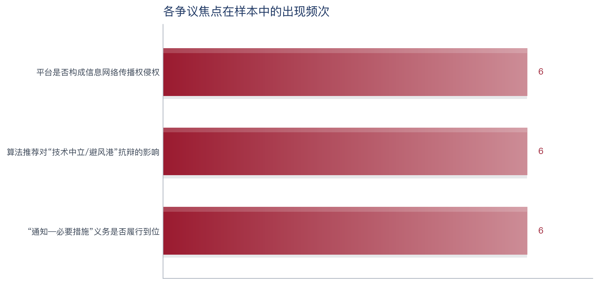
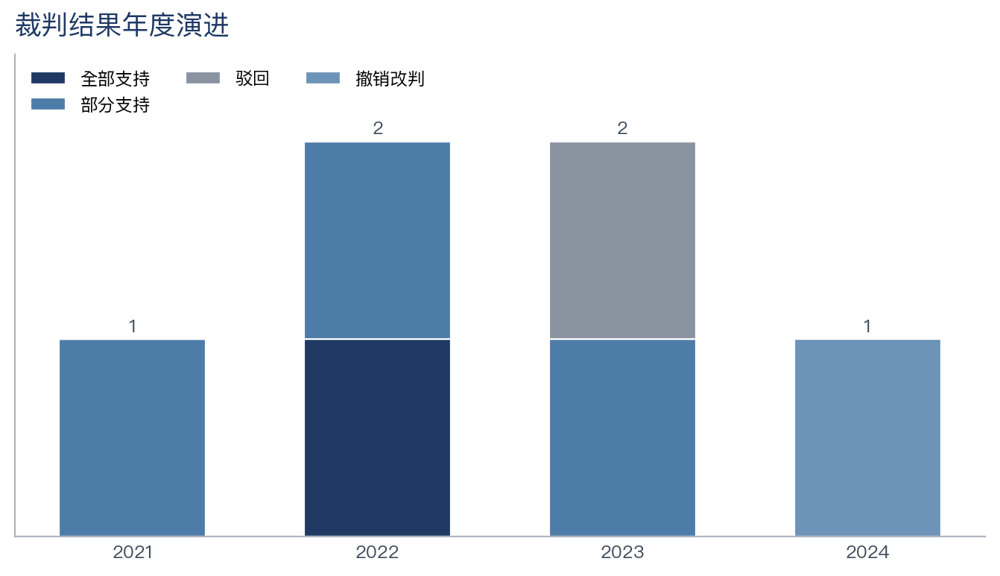

# 类案研究工作流（北大法宝 MCP × Claude Code）

[](https://github.com/Hausen24/legal-case-research/actions/workflows/ci.yml)
[](LICENSE)


> **A reproducible legal case-research workflow** that turns a fact pattern + search brief into a citation-checked, chart-rich Word report and an Excel case list — driven by the Peking University Law (北大法宝) MCP server and Claude Code, with sample-size-adaptive statistics and machine-verified anti-hallucination.

把一段案情 + 检索要求，自动跑成「类案分析报告 + Excel 清单」。本项目内置两套工作流：

| 技能 | 适用 | 去重逻辑 | 分析口径 | 产出 |
|------|------|----------|----------|------|
| **case-research**（通用类案研究） | 任意案情 + 数量/地域/法院级别要求 | 按 Gid 去重 | 动态争点体系 + 样本自适应六维统计 + 全文驱动深度 + 居中/攻方/辩方三场景 | 研报级报告（脚注/图表/封面）+ 案件清单 Excel |
| **securities-misrep-research**（证券虚假陈述专题） | 京沪金融法院等证券虚假陈述责任纠纷 | 按"公司+事件"分组、组内留核心判决，平行判决仅留痕 | 固定五维 14 问体系逐问梳理 + 京沪比较 | 投研级比较研究报告 + 核心判决清单 Excel |

两套共用同一份 `.mcp.json`、`CLAUDE.md`，以及 `scripts/build_report_docx.py`（渲染）、`scripts/chart_theme.py`（图表主题）、`scripts/common/stats_guard.py`（样本自适应闸门）、`scripts/common/pkulaw_utils.py`（公共派生）等共用层。

---

## 看一眼产出（Demo，无需法宝 Token）

北大法宝是订阅制，但你**不需要 Token 也能跑通整条管道、看到真实产出形态**——仓库自带一份[脱敏演示样本](examples/)（案号、当事人、裁判内容均为虚构，见 [DISCLAIMER](examples/DISCLAIMER.md)）。

```bash
pip install -r requirements.txt && npm install
python3 examples/build_demo_fixture.py                                   # 合成演示数据
python3 scripts/general/normalize_cases.py "examples/demo_算法推荐短视频侵权"
python3 scripts/general/run_analytics.py   "examples/demo_算法推荐短视频侵权"   # 统计 + 出图
python3 scripts/general/generate_excel.py  "examples/demo_算法推荐短视频侵权"
python3 scripts/build_report_docx.py "examples/demo_算法推荐短视频侵权" 类案分析报告_居中.md
python3 scripts/verify_report.py "examples/demo_算法推荐短视频侵权"          # 反幻觉校验
```

产出（点开即看）：[📄 报告 Markdown](examples/demo_算法推荐短视频侵权/output/类案分析报告_居中.md) · [📝 报告 Word](examples/demo_算法推荐短视频侵权/output/类案分析报告_居中.docx) · [📊 案件清单 Excel](examples/demo_算法推荐短视频侵权/output/案件清单.xlsx)

统一主题、样本量自适应的图表（由 `chart_theme` + `run_analytics` 自动生成）：

| 样本概览 | 争点频次 | 裁判结果年度演进 |
|---|---|---|
|  |  |  |

> 上图样本仅 6 件 → 工作流自动判定为「定性深挖档 / 仅描述性统计 / 不作地域分歧推断」，
> 报告措辞相应收敛为"示裁判取向、不作占比定论"——这正是 `stats_guard` 闸门的作用。

---

## 目录结构

```
case-research/
├── .mcp.json                 ← 你的真实 MCP 配置（从 .mcp.json.example 改，填 Token；已 gitignore）
├── .mcp.json.example         ← 配置模板（3 个必备服务 + 1 个可选法律法规服务）
├── CLAUDE.md                 ← 实践画像（先填你的偏好）
├── README.md
├── skills/
│   ├── case-research/                ← 通用类案研究技能
│   │   ├── SKILL.md
│   │   ├── methodology/              ← 动态争点体系 / 关键词策略 / 六维分析(样本自适应) / 相关度筛查
│   │   └── templates/                ← 三场景报告模板(v2 深度) + Excel schema
│   └── securities-misrep-research/   ← 证券虚假陈述专题技能
│       ├── SKILL.md
│       ├── methodology/              ← 五维 14 问题体系 / 核心判决识别+京沪比较
│       └── templates/                ← 证券比较研究报告模板
├── scripts/
│   ├── common/pkulaw_utils.py        ← 公共派生函数（clean_url / 法院层级含金融法院 / 字段回退…）
│   ├── build_report_docx.py          ← 报告转 Word（两技能共用）
│   ├── general/                      ← normalize_cases · run_analytics · generate_excel
│   └── securities/                   ← normalize_secmisrep · run_analytics_secmisrep · generate_excel_secmisrep
└── research/                 ← 每次研究一个子目录（自动生成，默认 gitignore）
```

## 首次使用

1. **填 MCP 配置**：把 `.mcp.json.example` 复制为 `.mcp.json`，两处 `你的Token` 替换为你的真实 Token。
   ```bash
   cp .mcp.json.example .mcp.json
   open -e .mcp.json   # 改 Token
   ```
2. **填实践画像**：打开 `CLAUDE.md`，把【待填】处改成你的偏好（角色、文风、报告格式、署名等）。
3. **装依赖**：`pip3 install pandas openpyxl`
4. **在本目录启动 Claude Code**：
   ```bash
   cd ~/Documents/case-research
   claude
   ```
   建议 `/model` 切到 Opus 4.8 做分析。输入 `/mcp` 确认三个服务都 Connected。

> ⚠️ 第 4 个「检索法律法规」服务为**可选**，仅证券专题的法条原文核对会用到；不订阅也能跑通主流程（详见 `.mcp.json.example` 里的说明）。

## 跑一次研究

### A. 通用类案研究（case-research）
在 Claude Code 里直接说，例如：

> 做一次类案研究。案情：短视频平台通过算法推荐机制，向用户推送了其他用户上传的未经授权的影视作品剪辑片段；权利人多次通知平台后，平台未采取有效措施。检索要求：北京、上海、广州三地法院；二审或再审优先；2021 年至今；目标 50 件普通案例。

Claude Code 会：
1. 抽取案情要素、**为本主题搭建争点体系（焦点/倾向标签/抗辩清单）**、构建三层关键词 → **停下让你确认（检查点 1）**
2. 多轮检索北大法宝、去重、双轨分流、相关度筛查 → **报告检索情况让你确认（检查点 2）**
3. 字段编码 → 样本自适应六维统计 + 出图 → 抓判决全文作深度来源 → 问你选场景（居中/攻方/辩方）→ 生成研报级报告（脚注/图表/封面）+ Excel

### B. 证券虚假陈述专题（securities-misrep-research）
> 做一次证券虚假陈述类案裁判规则研究，请加载 securities-misrep-research 技能。系统检索"证券虚假陈述责任纠纷"案由下北京/上海金融法院及对应高院的核心判决，按五维 14 问题体系逐问题梳理裁判观点、做京沪比较，平行判决仅留痕。

Claude Code 会：
1. 搭五维 14 问题体系、定关键词轮替与事件清单 → **停下让你确认（检查点 1）**
2. 关键词轮替检索 + 后过滤、按"公司+事件"分组识别核心判决 → **交你校核分组（检查点 2）**
3. 按问题编码 → 京沪交叉分析 → 联网核对典型案例名录 → 生成比较研究报告 + 核心判决清单 Excel

## 产出

```
research/<主题>_<日期>/output/
├── _charts/           统一主题图表 + manifest.json（报告占位符插图）
├── 类案分析报告_<场景>.md / .docx
├── 案件清单.xlsx（证券专题为 核心判决清单.xlsx）
└── 原文/              分析案件判决原文，每案一份 + 00_索引.md（报告深度来源）
```

> 原文导出：`python3 scripts/download_fulltext.py <research_dir> [--docx]`。读分析池 `05_enriched_cases.json`——通用工作流导出全部普通案例原文作为**报告深度写作的全文来源**；证券专题因 05 已折叠为核心判决，**批量同案只导出示范判决/核心判决**。正文要素来自北大法宝 MCP（非网页抓取），每份附法宝链接溯源；非普通案例正文为空，仅导出元数据+链接。

## 关键设计

- **只有普通案例（CaseGrade=07）有完整判决书要素**，进分析管道；经典/评析案例进 Excel 第二个 sheet「权威案例附录」。
- **关键词铁律**：案由词放 title，方法论词放 fulltext（否则会命中评析文章而非判决书）。
- **反幻觉**：所有案件来自 MCP，引用必带案号+法院+pkulaw 链接，不凭记忆编造。

## 可靠性与可复现

- **反幻觉是被机器证明的，不只是写在纪律里。** `scripts/verify_report.py` 扫描最终报告中的每一个案号，逐一比对本次检索样本池（`03_raw_cases.json`），凡引用了样本池中不存在的案号即报错、非零退出。**把"我们承诺不编案号"升级为"机器证明每个引用都可溯源"。** 收尾自检与 CI 都会跑它。
  ```bash
  python3 scripts/verify_report.py <research_dir>   # 全部命中→通过；有疑似编造→FAIL
  ```
- **自动化测试 + CI。** `tests/` 下的 pytest 覆盖公共派生、样本量自适应闸门（含"小样本不作分歧推断"的回归保护）、Excel 实质列非空、以及反幻觉校验的正反用例；GitHub Actions 每次推送/PR 跑全套测试 + 演示管道冒烟 + 反幻觉校验（见徽章）。
  ```bash
  pip install -r requirements.txt pytest && python3 -m pytest
  ```

## 调整工作流

- 改报告风格/格式 → 改 `CLAUDE.md`
- 改通用争点体系搭建套路 → 改 `skills/case-research/methodology/issue-framework.md`
- 改通用六维分析 / 样本自适应 → 改 `skills/case-research/methodology/analysis-dimensions.md` 和 `scripts/general/run_analytics.py`（阈值在 `scripts/common/stats_guard.py`）
- 改图表样式 → 改 `scripts/chart_theme.py`（两套工作流同时生效）
- 改通用 Excel 字段 → 改 `skills/case-research/templates/excel-schema.md` 和 `scripts/general/generate_excel.py`
- 改证券问题体系 → 改 `skills/securities-misrep-research/methodology/issue-framework.md`（14 问题键名须与脚本 `ISSUES` 一致）
- 改公共派生（法院层级/链接清洗等）→ 改 `scripts/common/pkulaw_utils.py`（两套工作流同时生效）

> v0.3：通用 case-research 深化到 v2——新增动态争点体系、样本量自适应闸门（`stats_guard`）、统一主题出图（`chart_theme`）、全文驱动的研报级三场景报告（脚注/图表/封面），与证券专题对齐共用层。
> v0.2：在通用版基础上新增证券虚假陈述专题；公共派生函数已抽到 `scripts/common/`，两套工作流共享一处维护。
