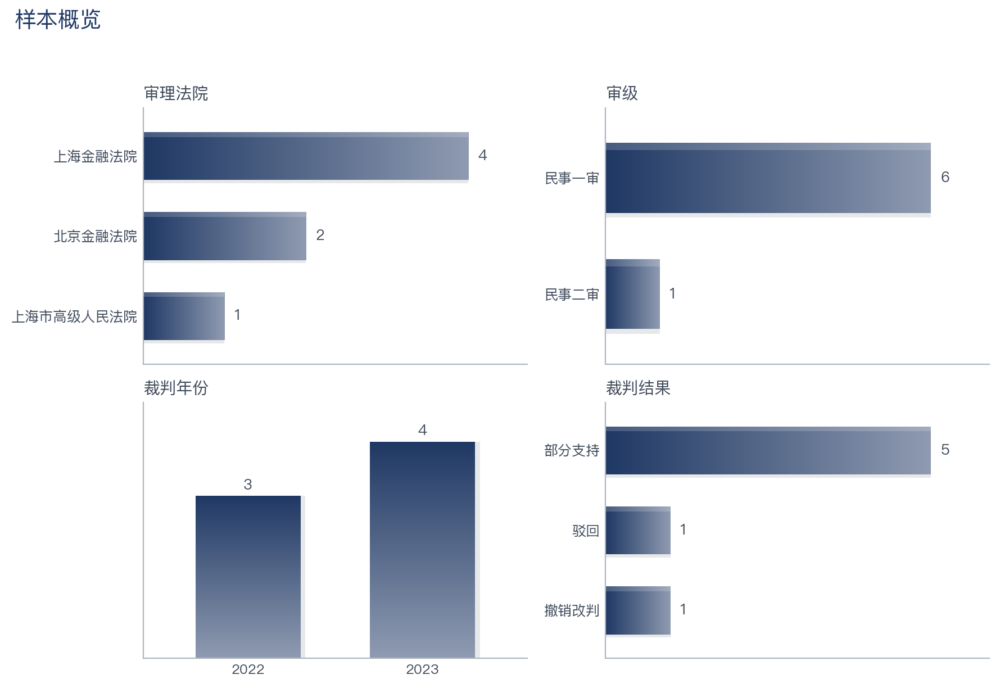
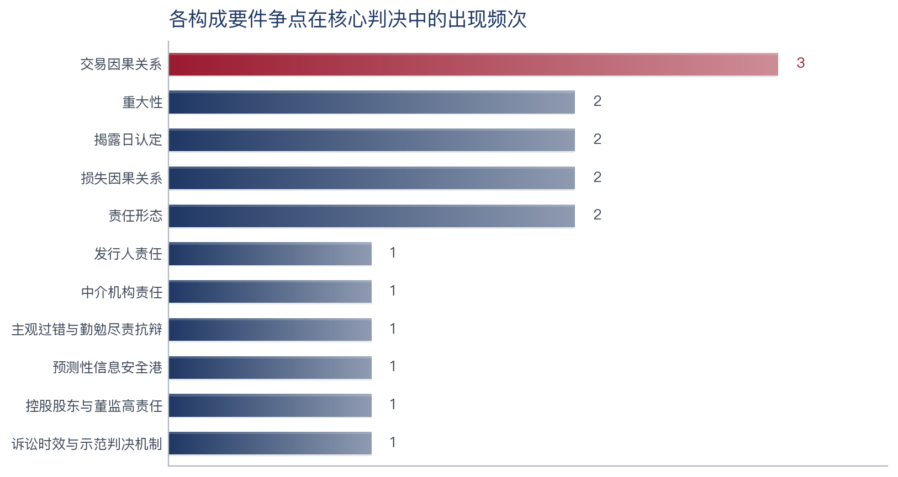
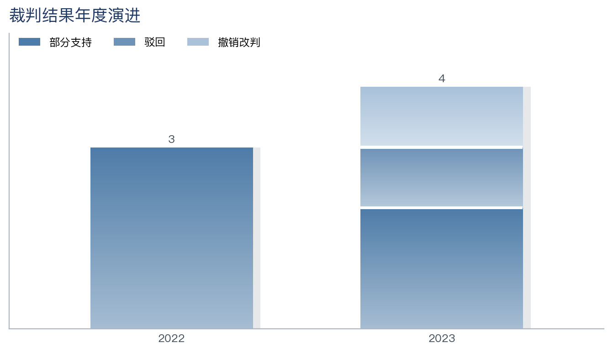

# 类案检索研究工作流（Legal Case-Research Workflow）

[](https://github.com/Hausen24/legal-case-research/actions/workflows/ci.yml)
[](LICENSE)


> **A reproducible legal case-research workflow** that turns a fact pattern + search brief into a citation-checked, chart-rich Word report and an Excel case list — with sample-size-adaptive statistics and machine-verified citation traceability. Works with the Peking University Law (北大法宝) MCP **or your own case data**, and with **any** capable AI agent (not only Claude). See [AGENTS.md](AGENTS.md).

把一段案情 + 检索要求，自动跑成「**裁判规则研究报告 / 类案检索报告（Word）+ 类案检索清单（Excel）**」。数据源默认北大法宝 MCP，**也支持自带数据**（无订阅亦可，见 [AGENTS.md](AGENTS.md) 与 [输入数据契约](examples/输入数据契约.md)）。

**项目总纲**：单一技能 `case-research`，**两大研究模式由用户指定**（学理研究/实案研究），案件形态由阀门自动判断；其中**实案研究 = 裁判规则研究的 plus 版本，只多不少**——裁判规则研究的全部模块整体内嵌为实案报告的主体，实案模式在其之前额外做指定法院的四顺位类案深挖，任何模块深度不降一分。

**开关一 · 研究模式**：

| 模式 | 检索范围 | 产出 |
|---|---|---|
| **学理研究**（默认） | 全国，不限法院 | **`<主题>-裁判规则研究报告`**：构成要件/争点逐节四段（含理论展开）+ 新旧规演进 + 地域分布图 + 争点×地域观点矩阵（措辞受样本量闸门约束） |
| **实案研究**（plus） | 全国（供全景）＋ 指定**核心法院**按最高法《类案检索指导意见》（法发〔2020〕24号）**第四条四顺位**深挖 | **`<案件类别>-类案检索报告`**：「类案规则」专章逐顺位**六件套**深挖（案情/抗辩逐条/裁判逐条对应/**证据对照表**/相似性量化评分/参照要点+第九条效力标注）→ 内嵌完整裁判规则全景 → 控辩要点+**证据准备清单** → 满足**第八条**要素、**可随案归档** |

**开关二 · 案件形态（自动检测阀门）**：散案/集团案**无须用户指定**——检索后由阀门
`fold_group_cases.py` 自动判断：发现「同一被告×同一法院」成串相似判决（组规模≥4）即判定
集团性诉讼形态，自动折叠为核心判决+平行留痕（三级分组键：标题公司名→正文公司名+法院→
说理指纹），结果在检查点 2 交用户校核。

| 形态 | 去重逻辑 | 深度管道 |
|---|---|---|
| **散案**（阀门未触发） | 按 `Gid` 去重 | 通用管道（动态争点体系 + 六维统计） |
| **集团/群体性案件**（阀门触发） | 按"被告主体＋共同事件"折叠，组内留核心实质判决 | 长表管道（争点分叉·抗辩↔裁判对应三 sheet Excel）；内置**证券虚假陈述**示范样例 |

模式×形态四种组合均经实战/演示验证。实案模式顺位①由内置的**最高法指导性案例本地数据集**（[data/guiding_cases/](data/guiding_cases/)，官网合规抓取 263 案全文，定期增量更新）提供全文；直辖市多中院映射（朝阳区→北京三中院）由 `court_hierarchy` 解析并在检查点 1 确认；相似性按**三要素加权评分量表**（100 分制）量化留痕。

共用层：渲染 `build_report_docx.py`、图表主题 `chart_theme.py`、样本闸门 `stats_guard.py`、公共派生 `pkulaw_utils.py`、反幻觉校验 `verify_report.py`、覆盖率自检 `check_coverage.py`、契约校验 `validate_pipeline.py`。

---

## 看一眼产出（Demo，无需法宝 Token）

北大法宝是订阅制，但你**不需要 Token 也能跑通整条管道、看到真实产出形态**——仓库自带[脱敏演示样本](examples/)（案号、当事人、裁判内容均为虚构，见 [DISCLAIMER](examples/DISCLAIMER.md)）。

同一套合成数据（证券虚假陈述，7 件核心判决），产出**两大研究模式的结构示范**——这正是本项目的核心区分：

**示范一 · 实案研究模式** →《证券虚假陈述案件-**类案检索报告**》：给案情＋核心法院，前置「类案规则」四顺位深挖章（相似性评分 93 的基准案六件套：案情/抗辩逐条/裁判逐条对应/证据对照表/评分表/参照要点）→ 内嵌裁判规则全景 → 控辩要点＋证据准备清单 → 第八条合规附录，可随案归档。
[📝 Word](examples/demo_证券虚假陈述集团诉讼/output/证券虚假陈述案件-类案检索报告-20260609.docx) · [📄 Markdown](examples/demo_证券虚假陈述集团诉讼/output/证券虚假陈述案件-类案检索报告-20260609.md)

**示范二 · 学理研究模式** →《证券虚假陈述-**裁判规则研究报告**》：只给一个主题，全国全景——五维逐节四段（理论展开＋主流规则＋例外反向＋评析演进），无控辩模块。
[📝 Word](examples/demo_证券虚假陈述集团诉讼/output/证券虚假陈述-裁判规则研究报告-20260609.docx) · [📄 Markdown](examples/demo_证券虚假陈述集团诉讼/output/证券虚假陈述-裁判规则研究报告-20260609.md)

清单两模式共用：[📊 核心判决清单 Excel](examples/demo_证券虚假陈述集团诉讼/output/证券虚假陈述案件-类案检索清单-20260609.xlsx)（长表三 sheet＋裁判分歧清单）

```bash
pip install -r requirements.txt && npm install
python3 examples/build_demo_secmisrep.py                                          # 合成演示数据
python3 scripts/securities/normalize_secmisrep.py    "examples/demo_证券虚假陈述集团诉讼"
python3 scripts/securities/run_analytics_secmisrep.py "examples/demo_证券虚假陈述集团诉讼"   # 统计+出图
python3 scripts/securities/generate_excel_secmisrep.py "examples/demo_证券虚假陈述集团诉讼" --name "证券虚假陈述案件" --date 20260609
python3 scripts/build_report_docx.py "examples/demo_证券虚假陈述集团诉讼" "证券虚假陈述案件-类案检索报告-20260609.md"      # 实案示范
python3 scripts/build_report_docx.py "examples/demo_证券虚假陈述集团诉讼" "证券虚假陈述-裁判规则研究报告-20260609.md"     # 学理示范
python3 scripts/verify_report.py "examples/demo_证券虚假陈述集团诉讼"                # 反幻觉校验（两份均扫）
```

统一主题、样本量自适应的图表（由 `chart_theme` + 分析脚本自动生成）：

| 样本概览 | 争点频次 | 裁判结果年度演进 |
|---|---|---|
|  |  |  |

> 本样本核心判决 7 件、上海 5/北京 2 → 工作流自动判定为「定性深挖档 / 仅描述性统计 / **不作地域分歧推断**」，
> 报告措辞相应收敛为"示裁判取向、不作占比定论"——这正是 `stats_guard` 闸门的作用（防止"京沪 2 件就编出地域差异"）。

> **关于深度（重要）**：此 demo 是**格式与可复现性样本**，用于证明整条管道（结构 / 脚注 / 图表 / 命名 / 样本量闸门 / 反幻觉校验）无需 Token 即可端到端跑通。它的**分析深度受限于合成演示数据**——demo 没有判决全文。**真实运行时**，工作流会先用 `download_fulltext` 抓取每份判决的完整文书，据此把每个争点重构成 500–1500 字的实证说理（请求权基础→各方抗辩→法院说理与取舍→结论），产出篇幅与深度通常是本 demo 的**数倍**。换言之：demo 展示的是"机器能不能跑通、排版长什么样"，不是"分析能写多深"。

> 案件形态（散案/集团案）由阀门自动判断，与模式无关；散案管道示例（短视频侵权）见 [`examples/demo_算法推荐短视频侵权/`](examples/demo_算法推荐短视频侵权/output/)。

---

## 没有北大法宝？没有 Claude？

- **没有法宝订阅** → **自带数据模式**：把你的判决数据整理成扁平 CSV/JSON（[字段契约](examples/输入数据契约.md)），用 `python3 scripts/general/import_cases.py <dir> --json/--csv <file>` 转成管道输入，分析与产出链路完全相同。
- **不用 Claude** → 本项目的技能是**自包含的 SOP**、脚本是**纯 Python/Node**。任何能读仓库文件、跑命令、（可选）调 MCP 的 AI 智能体都能驱动它（Cline / Cursor / Windsurf / Continue / Aider / Codex CLI / Gemini CLI 等）。详见 [AGENTS.md](AGENTS.md)。

---

## 目录结构

```
legal-case-research/
├── .mcp.json.example         ← MCP 配置模板（复制为 .mcp.json 填 Token；.mcp.json 已 gitignore）
├── CLAUDE.example.md         ← 个人实践画像模板（复制为 CLAUDE.md 填偏好；CLAUDE.md 已 gitignore）
├── AGENTS.md                 ← 工具无关运行指南（任何 AI 智能体怎么跑）
├── skills/
│   └── case-research/                ← 统一类案研究技能（模式：学理/实案 由用户定；形态：散案/集团案 阀门自动；内置证券示范样例）
├── scripts/
│   ├── common/                       ← pkulaw_utils（公共派生）· stats_guard（样本自适应闸门）
│   ├── build_report_docx.py + render_report.mjs   ← 报告转 Word
│   ├── chart_theme.py                ← 统一图表主题
│   ├── verify_report.py              ← 反幻觉收尾自检
│   ├── general/                      ← normalize_cases · run_analytics · generate_excel · import_cases(自带数据)
│   └── securities/                   ← 集团案·证券示例：normalize/run_analytics/generate_excel_secmisrep
├── examples/                 ← 脱敏 demo（无需 Token 可跑）+ 输入数据契约
├── tests/                    ← pytest（CI 运行）
└── research/                 ← 每次研究一个子目录（含当事人信息，默认 gitignore）
```

## 首次使用

1. **填 MCP 配置**（用法宝时）：`cp .mcp.json.example .mcp.json`，把 `你的Token` 换成真实 Token。不用法宝可跳过（走自带数据模式）。
2. **填个人画像**：`cp CLAUDE.example.md CLAUDE.md`，把【】处改成你的偏好（角色、文风、署名等）。`CLAUDE.md` 已 gitignore，不入库。
3. **装依赖**：`pip install -r requirements.txt && npm install`
4. **启动**：在本目录开 Claude Code（或其它 AI 智能体，见 [AGENTS.md](AGENTS.md)）；用法宝时 `/mcp` 确认服务 Connected，建议 `/model` 切 Opus 4.8 做分析。

> ⚠️ 「检索法律法规」服务为**可选**，仅证券示例的法条原文核对会用到；不订阅也能跑通主流程。

## 跑一次研究（按两大研究模式）

### A. 实案研究模式——手上有案子，要可归档的类案检索报告

提示词模板（给**案情 ＋ 核心法院**，时间/数量要求可选）：
> 做一次类案研究，**实案研究模式**。案情：〔一段案情，如"甲上市公司 2021—2025 年虚增营收利润，2026 年被证监会立案调查，多名投资者起诉索赔"〕。核心法院：**上海金融法院**。

流程：四顺位法院解析＋要素拆解＋A/B 关键词 →（**检查点 1**：确认争点体系、关键词与顺位法院清单）→ 全国检索＋顺位标注，集团案阀门自动折叠 →（**检查点 2**：确认样本与分组）→ 逐案量化评分与六件套深挖、编码、统计出图、抓全文 → 产出。

产出：**`<案件类别>-类案检索报告-<日期>`**（四顺位深挖章＋内嵌裁判规则全景＋控辩要点与证据准备清单＋第八条合规附录，可随案归档）＋ 类案检索清单 Excel ＋ 判决原文集。

### B. 学理研究模式——做规则研究，要全国全景的研究报告

提示词模板（给**一个主题或一段案情**即可，无须指定法院）：
> 做一次裁判规则研究，**学理研究模式**。主题：**证券虚假陈述**〔或换任意案由/一段案情〕。全国范围。

流程：五维拆解主题＋A/B 关键词 →（**检查点 1**：确认五维争点体系与关键词）→ 两轮全国检索＋基础筛查（无需相似度定档），集团案阀门自动折叠 →（**检查点 2**：确认样本）→ 深度编码、14 问/争点聚合、全国地域图与争点×地域热力 → 产出。

产出：**`<主题>-裁判规则研究报告-<日期>`**（制度变迁总览＋五维逐节四段：理论展开/主流规则/例外反向/评析演进＋学理争议对照＋分歧地图；无控辩模块）＋ 清单 Excel ＋ 判决原文集。

> 两模式中，**案件形态（散案/集团案）无须指定**——检索后阀门自动检测"同被告×同法院成串相似判决"并折叠核心判决，结果在检查点 2 交你校核。

## 产出

```
research/<主题>_<日期>/output/
├── _charts/                              统一主题图表 + manifest.json（报告占位符插图）
├── <案件类别>-类案检索报告-<YYYYMMDD>.md / .docx
├── <案件类别>-类案检索清单-<YYYYMMDD>.xlsx
└── 原文/                                 分析案件判决原文，每案一份 + 00_索引.md（报告深度来源）
```

> 命名规范：实案模式 `<案件类别>-类案检索报告-<YYYYMMDD>`；学理模式 `<主题>-裁判规则研究报告-<YYYYMMDD>`；清单统一 `<类别>-类案检索清单-<YYYYMMDD>`。
> 原文导出：`python3 scripts/download_fulltext.py <research_dir> [--docx]`，作为报告深度写作的全文来源。

## 关键设计

- **只有普通案例（CaseGrade=07）有完整判决书要素**，进分析管道；经典/评析/指导案例进附录索引。
- **关键词铁律**：案由词放 title，方法论词放 fulltext（否则命中评析文章而非判决书）。
- **样本量自适应**（`stats_guard`）：小样本只做描述性、逐争点深挖；分组样本不足时不作分组差异推断。
- **反幻觉**：所有案件来自数据源，引用必带案号+法院+链接，不凭记忆编造。

## 模块地图（本项目核心亮点，fork 后按图索骥）

| 模块 | 做什么 | 文件 |
|---|---|---|
| 四顺位类案引擎 | 按法发〔2020〕24号第四条解析核心法院的检索顺位（直辖市多中院映射） | `scripts/common/court_hierarchy.py` + `data/court_hierarchy.json` |
| 指导性案例数据集 | 最高法官网 263 案全文本地化（顺位①深度比对来源） | `scripts/fetch_guiding_cases.py` + `data/guiding_cases/` |
| 相似性量化评分 | 三要素加权 100 分制（基本事实50+争议焦点30+法律适用20），分项留痕可复核 | `skills/case-research/methodology/relevance-screening.md` |
| 集团案阀门+折叠 | 自动检测成串平行判决并折叠核心判决 | `scripts/general/fold_group_cases.py` |
| 样本量自适应闸门 | 小样本禁统计推断/分组比较，防伪差异 | `scripts/common/stats_guard.py` |
| 分歧地图 | 同争点对立立场+代表案对，一等产出 | `scripts/common/divergence.py` |
| 证据线 | 深挖案证据对照表（争点｜原告举证｜被告举证｜法院采信）+ 控辩证据准备清单 | `templates/report-neutral.md` §1 六件套 |
| 编码抽检 | 编码结论 vs 原文摘录对照复核单（用户确认留痕） | `scripts/general/spot_check_coding.py` |
| 编码落盘 | AI 产纯 JSON 编码→合并入 05（受保护字段拒改写） | `scripts/general/apply_coding.py` |
| 报告范式 | 五维四段（理论展开+主流规则+例外反向+评析演进）、制度变迁总览、学理争议对照 | `templates/report-*.md` |
| 统一图表 | 冷蓝渐变设计系统：概览/争点频次/年度演进/全国地域/争点×地域热力 | `scripts/chart_theme.py` + `render_region_charts.py` |
| 引用溯源+引文核验 | 案号逐一溯源样本池（FAIL 级）＋直接引文在判决语料中匹配（伪造原话即标出） | `scripts/verify_report.py` |
| 覆盖率自检 | 关键词命中矩阵/名录缺口/顺位覆盖，量化"检索有多全" | `scripts/check_coverage.py` |
| 契约校验 | 管道各阶段字段类型/枚举/拼写一致性当场报错 | `scripts/validate_pipeline.py` |
| Word 渲染 | 封面两行标题/署名页脚/内容感知列宽/链接转脚注/西文 Times New Roman | `scripts/build_report_docx.py` + `render_report.mjs` |

## 可靠性与可复现

- **引用可溯源性是被机器证明的（边界如实声明）。** `scripts/verify_report.py` 两层校验：①案号溯源——报告引用的每个案号逐一比对样本池，池外案号即 FAIL；②引文核验——报告中引号内的直接引文在判决全文语料中归一化匹配（嵌套引号容错），逐字引用应当命中、伪造"判决原话"会被标出，未命中清单提示人工抽核（`--strict-quotes` 可升级为 FAIL）。引号纪律：弯引号“”专用于逐字引用（受核验），「」用于术语归纳（不核验）；“模糊命中”指约 2/3 以上连续片段在原文中存在——主体来自原文但**不保证逐字一致**。**诚实边界**：以上证明的是引用与引文的可溯源性，**不能证明全部转述内容无误**——转述质量由编码抽检（下条）与两个人工检查点把关。
- **编码质量有抽检机制。** 焦点立场/抗辩采纳等判断性编码完成后，`spot_check_coding.py` 随机抽取 ≥15%（至少 3 件）生成"编码结论 vs 原文摘录"对照复核单，随检查点交用户逐件确认留痕——内容分析法编码者信度的工程化替代（同案双跑 Kappa 见 ROADMAP）。
- **检索覆盖率是被量化的。** `scripts/check_coverage.py` 输出关键词命中矩阵（含边际贡献）、去重审计与典型案例名录缺口表——把"完整性不可保证"变成可呈报的量化缺口，亦可作为符合最高法类案检索指导意见（法发〔2020〕24号）第八条"方法/结果"要素的检索过程底稿。**量化不等于消除**：数据源单查询 10 条上限是结构性约束，缺口只能靠关键词扩展轮替、名录核对补检与自带数据混合来缓解，无法根除——使用者应据覆盖率报告自行判断样本是否足以支撑结论。
- **数据契约是被校验的。** `scripts/validate_pipeline.py` 对管道各阶段做字段类型/枚举/争点名拼写一致性校验，AI 编码的漏填错键当场报错，而不是等成品出现空列。
- **裁判分歧是一等产出。** 同一争点对立立场并存的争点清单、各立场代表案对与地域观察，自动进入分析数据与 Excel「裁判分歧清单」；是否构成地域倾向结论仍由样本量闸门裁定。
- **自动化测试 + CI。** `tests/` 下 pytest 覆盖公共派生、样本量闸门（含"小样本不作分歧推断"回归保护）、Excel 实质列非空、自带数据导入、反幻觉校验正反用例；GitHub Actions 每次推送/PR 跑全套测试 + 演示管道冒烟 + 反幻觉校验（见徽章）。
  ```bash
  pip install -r requirements.txt pytest && python3 -m pytest
  ```

## 调整工作流

- 改报告风格/格式 → 改 `CLAUDE.md`（从 `CLAUDE.example.md` 复制）
- 改标准检索争点体系 → `skills/case-research/methodology/issue-framework.md`
- 改样本自适应阈值 → `scripts/common/stats_guard.py`；改图表样式 → `scripts/chart_theme.py`（两套同时生效）
- 改证券示例问题体系 → `skills/case-research/methodology/issue-framework-secmisrep.md`（问题键名须与脚本 `ISSUES` 一致）
- 换一类集团诉讼（产品责任/消费者集体维权/环境侵权等）→ 保持机制不变，替换问题体系、事件识别口径、典型案例名录三处
- 改公共派生（法院层级/链接清洗等）→ `scripts/common/pkulaw_utils.py`（两套同时生效）

更新历史见 [CHANGELOG.md](CHANGELOG.md)。
